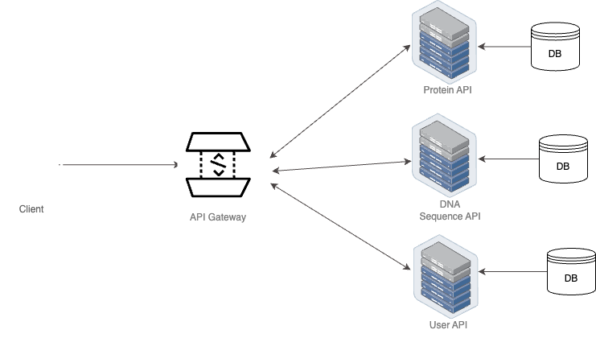

## BioSeqAnalyzer A Simple Protein & DNA Sequence analyzer project.

## Protein:

Proteins, the building blocks of life, are large, complex molecules that play many critical roles in the body. For example hemoglobin is a protein that moves oxygen in your blood to your muscles. Other proteins such as lactase enzymes help us digest milk.

A protein is a linear chain of amino acids. There are 20 [standard amino acids.](https://www.cup.uni-muenchen.de/ch/compchem/tink/as.html)This "alphabet" lets us represent a protein as a sequence of discrete tokens. This is known as a protein's primary structure.

In protein engineering, the goal is to improve the property of a protein sequence by changing its amino acid sequence (primary structure) and measuring the property of different variants. The projects start with a “wild type” protein that has a given reference sequence. Then mutations to this sequence are introduced and their results on a given property of that protein are measured in a laboratory

## DNA Sequencing:

DNA sequencing is the process of determining the order of the nucleotides in a DNA molecule. The nucleotides are the building blocks of DNA, and their sequence encodes the genetic information that cells use to develop and operate. DNA sequencing is a powerful tool that is used in a variety of fields, including basic research, medical diagnostics, and forensic science.

Here is a more detailed explanation of DNA sequencing:

DNA is a double-stranded molecule, and the two strands are held together by complementary base pairs. The four bases in DNA are adenine (A), guanine (G), cytosine (C), and thymine (T). A pairs with T, and C pairs with G.

DNA sequencing methods typically work by breaking down the DNA molecule into smaller fragments and then determining the sequence of bases in each fragment. The fragments can be separated by size, and then the bases in each fragment can be identified using chemical or enzymatic methods.

Once the sequence of bases in each fragment is known, the sequence of the entire DNA molecule can be assembled by overlapping the fragments.

## Software Artchitecure:



## Requirements

To run this application, you will need:

* Docker installed on your machine
* A terminal or command prompt

## Installation

To install this application, follow these steps:

* Clone this repository to your machine: `git clone https://github.com/JHorlamide/BioSeqAnalyzer.git`
* Navigate to the project directory: `cd BioSeqAnalyzer`

## Running the Application

To start the application use docker compose:

* Navigate to the project directory: `cd infrastructure`
* `docker-compose up --build -d`
* To test the API endpoints, you can use a tool like [Postman](https://www.postman.com/downloads/) or [curl](https://curl.se/). For example, to create a new resource using `curl`, you can run the following command:

  * ```
    curl -X POST -H "Content-Type: application/json" -d '{ "name": "Growth", "description": "Scale the business" }' http://localhost:7071/api/protein-projects
    ```

## Usage

#### Protein API Endpoints:

The API endpoints of the service are described below:

* `POST /api/protein-projects`: Create a new protein project.
* `GET /api/protein-projects`: Get all projects belonging to the authenticated user.
* `GET /api/protein-projects/:projectId:` Get projects by project ID
* `PUT /api/protein-projects/:projectId:` Update a projects details with the given project ID
* `DELETE /api/protein-projects/:projectId:` Delete a project with the given project ID
* `POST /api/protein-projects/:projectId/csv-upload:` Upload csv file for a project by the given project ID if no file as been uploaded using the.
* `GET /api/protein-projects/:projectId/summary-table-of-main-matrices:` Get summary of main matrices data from CSV.
* `GET /api/protein-projects/:projectId/top-performing-variants:` Get top performing variants data from CSV.
* `GET /api/protein-projects/:projectId/score-distribution:` Get top score distribution data from CSV.

#### DNA API Endpoints:

The API endpoints of the service are described below:

* `POST /api/dna-sequence`: Create a new DNA sequence project via project form, file upload, and import from database.
* `GET /api/dna-sequence/:projectId`: Get DNA sequence project details.
* `PUT /api/dna-sequence/:projectId:` Update DNA sequence projects details with the given project ID.
* `DELETE /api/dna-sequence/:projectId:` Delete DNA sequence project with the given project ID. This also deleted the associated file on S3 if any.
* `DELETE /api/delete-projects/:` Deletes all user projects. This happens when the user delete their accounts.
* `GET /api/add-user-to-project:` This adds an invited user to a project if they choose to accept the invitation to a project.
* `GET /api/project-share/:projectId:` Gives you a project details via an unprotected route.

#### User API Endpoints:

The API endpoints of the service are described below:

* `POST /api/users/register`: Creates a new user. body ->
  ```
  {fullName: "string", emai: "string", password: "string"}
  ```
* `GET /api/users/invite`: Sends invitation email to invite a user to a project. body -> `{userEmail: "string", projectId: "string", projectName: "string"}`
* `GET /api/users/invite/accept:` Accepts an invitation to a projects. body -> `{invitationToken: "string", userEmail: "string", fullName: "string", password: "string"}`
* `PUT /api/users/account/delete:` Deletes a user account. Delete an account deletes all associated projects (protein & DNA sequence projects).

#### Authentication API Endpoints:

The API endpoints of the service are described below:

* `POST /api/users/login`: Login user if the provided credential are correct. body -> {
  ```
  emai: "string", password: "string"}
  ```
* `GET /api/users/refresh-token`: Refresh user authe token if the accessToken has expired. body -> `{refreshToken: "string"}`
* `GET /api/users/forgot-password:` Sends a forgotpassword email to the user account if the provided email ID is valid. body ->` {email: "string"}`
* `PUT /api/users/reset-password:` Resets the user password. body ->
  ```
  {password: "string", confirmPassword: "string", passwordToken: "string"}
  ```

## Running Test

To ensure the reliability and accuracy of the application, I have implemented a simple suite of tests. While these tests are not exhaustive, but they cover some critical aspects of the API implementation. To run the tests, use the following commands:

**Protein API Service**

* From the root Directory of the BioSeqAnalyzer, `cd` into `protein-analyzer`.
* To run the tests in watch mode, use the command `npm run test:watch`.
* To run the tests without watch mode, use the command `npm run test`.

**User API Service**

* From the root Directory of the BioSeqAnalyzer, `cd` into `user-service`.
* Run the tests in watch mode, use the command `npm run test:watch`.

**DNA Sequence API Service**

* From the root Directory of the BioSeqAnalyzer, `cd` into `dna-sequence`.
* Run the tests `pytest`.

I take application testing seriously and am committed to ensuring the highest possible quality of software :)
